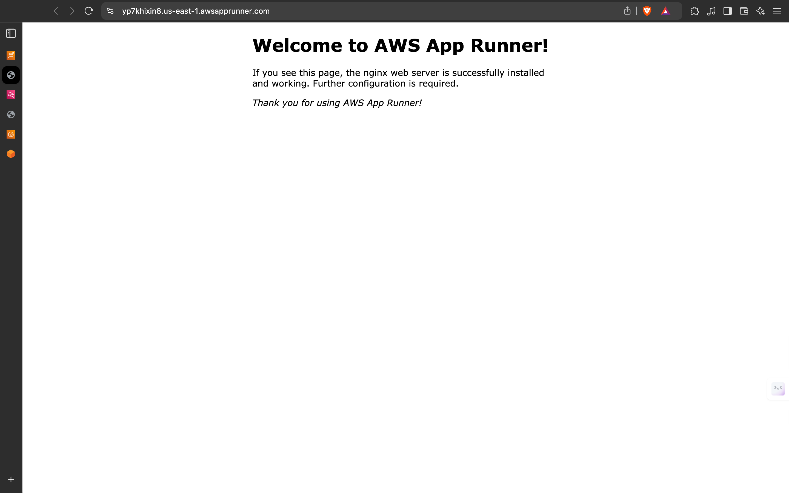
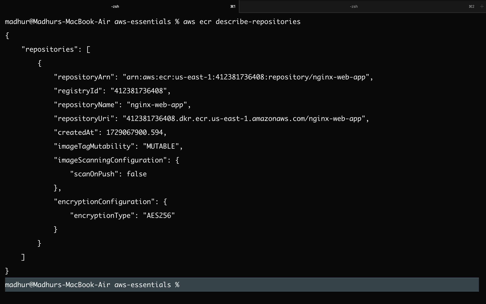
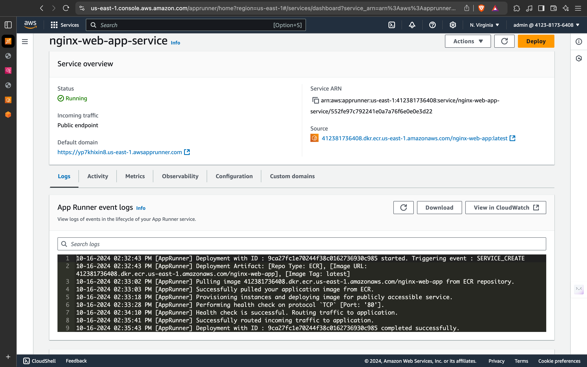

# Deploy a Web App on Nginx Server using AWS App Runner



## Overview

In this tutorial, you will learn how to deploy a sample containerized application on a Nginx server using AWS App Runner. AWS App Runner is a fully managed service that makes it easy for developers to quickly deploy containerized web applications and APIs, at scale and with no prior infrastructure experience required. Start with your source code or a container image. App Runner automatically builds and deploys the web application and load balances traffic with encryption. App Runner also scales up or down automatically to meet your traffic needs.

## What You Will Accomplish

In this tutorial, you will:
- Create a container image for your web app.
- Push the image to Amazon Elastic Container Registry (ECR).
- Create an AWS App Runner service.
- Clean up your resources.

## Prerequisites

Before starting this tutorial, you will need:
- An [AWS account](https://aws.amazon.com/): If you don't already have one, follow the [Setup Your Environment](https://docs.aws.amazon.com/cli/latest/userguide/cli-configure-quickstart.html) tutorial.
- [AWS Command Line Interface (CLI)](https://aws.amazon.com/cli/) installed and configured.
- [Docker Engine](https://www.docker.com/get-started) installed, and the application started.
- [Visual Studio Code](https://code.visualstudio.com/) installed.

## Implementation

Use the following step-by-step written tutorial or watch the video to learn how to deploy a web application on an Nginx server using AWS App Runner.

### Step 1: Create a Container Image

In this step, you will create a container image of a sample web app.

1. **Create a new folder**:
   ```bash
   mkdir nginx-web-app
   cd nginx-web-app
   ```

2. **Open Visual Studio Code** and navigate to the `nginx-web-app` folder.

3. **Create a new file** named `index.html` and update it with the following code, then save the file:
   ```html
   <!DOCTYPE html>
   <html>
   <head>
   <title>Sample Web App</title>
   <style>
   html { color-scheme: light; }
   body { width: 35em; margin: 0 auto; font-family: Amazon Ember, Verdana, Arial, sans-serif; }
   </style>
   </head>
   <body>
   <h1>Welcome to AWS App Runner!</h1>
   <p>If you see this page, the nginx web server is successfully installed and working. Further configuration is required.</p>
   <p><em>Thank you for using AWS App Runner!</em></p>
   </body>
   </html>
   ```

4. **Create another file** named `Dockerfile` and update it with the following code, then save the file:
   ```dockerfile
   FROM --platform=linux/amd64 nginx:latest
   WORKDIR /usr/share/nginx/html
   COPY index.html index.html
   ```

5. **Build the container image** by running the following command in the terminal:
   ```bash
   docker build -t nginx-web-app .
   ```

### Step 2: Push to Amazon ECR



In this step, you will create a private repository in Amazon ECR and push the container image you built in the previous module to the newly created repository.

1. **Sign in** to the [AWS Management Console](https://aws.amazon.com/console/) and open the Amazon Elastic Container Registry at [ECR Console](https://console.aws.amazon.com/ecr/home).

2. For **Create a repository**, choose **Create**.

3. On the **Create repository** page, for **Repository name**, enter `nginx-web-app`, leave the default selections, and select **Create repository**.

4. Once the repository has been created, select the radio button for the repository, and then select **View push commands**.

5. Follow all the steps in the pop-up window to authenticate and push the image to the repository.


    ```bash
   docker build -t nginx-web-app .
   ```
   
   ```bash
   docker tag nginx-web-app:latest 412381736408.dkr.ecr.us-east-1.amazonaws.com/nginx-web-app:latest.
   ```
   #### docker tag: This command creates a new tag for an existing image. Tagging is a way to give a specific image a name or version that may be different from its original name.
    ####    nginx-web-app:latest: This specifies the source image you want to tag. Here, it refers to the nginx-web-app image with the latest tag.
   #### 412381736408.dkr.ecr.us-east-1.amazonaws.com/nginx-web-app:latest: This is the new tag you are creating for the image. It indicates that you are tagging the image to be pushed to Amazon Elastic Container Registry (ECR). The format includes the ECR registry URL, followed by the repository name and the tag.
   
    ```bash
    docker push 412381736408.dkr.ecr.us-east-1.amazonaws.com/nginx-web-app:latest
   ```
   #### docker push: This command uploads a Docker image to a remote repository.
   #### 412381736408.dkr.ecr.us-east-1.amazonaws.com/nginx-web-app:latest: This specifies the image you want to push to ECR. It must match the repository URL and tag you used in the previous command.

### Step 3: Create AWS App Runner Service

In this module, you will create an AWS App Runner service using the container image you built in the previous module.



 ```bash
 aws apprunner create-service --service-name nginx-web-app-service \
--source-configuration "ImageRepository={ImageIdentifier=412381736408.dkr.ecr.us-east-1.amazonaws.com/nginx-web-app:latest, ImageRepositoryType=ECR, ImageConfiguration={Port=80}}, AuthenticationConfiguration={AccessRoleArn=arn:aws:iam::123456789012:role/AppRunnerECRAccessRole}"
```

1. **Sign in** to the [AWS Management Console](https://aws.amazon.com/console/) and open AWS App Runner at [App Runner Console](https://console.aws.amazon.com/apprunner/home).

2. Choose **Create an App Runner service**.

3. In the **Source and deployment** section, leave the default selections for **Repository type** and **Provider**. For **Container image URI**, select **Browse**.

4. In the pop-up window, for **Image repository**, select `nginx-web-app`, and choose **Continue**.

5. In the **Deployment settings** section, for **ECR access role**, select **Create new service role**, and choose **Next**.

6. On the **Configure service** page, for **Service name**, enter `nginx-web-app-service`, and change the **Port** to `80`. Leave the rest as default, and select **Next**.

7. On the **Review and create** page, review all inputs, and choose **Create & deploy**.

   It will take several minutes for the service to be deployed. You can view the event logs for progress.

8. Once the status updates to **Running**, choose the default domain name URL to view the web app.

   The Welcome page and confirmation message should look like the image on the right.

### Clean Up Resources

To avoid incurring additional costs, remember to clean up your resources after completing the tutorial by deleting the App Runner service and the ECR repository.

## Conclusion

You have successfully deployed a containerized web application on an Nginx server using AWS App Runner. You can now scale your application and manage it efficiently using AWS services.
```

